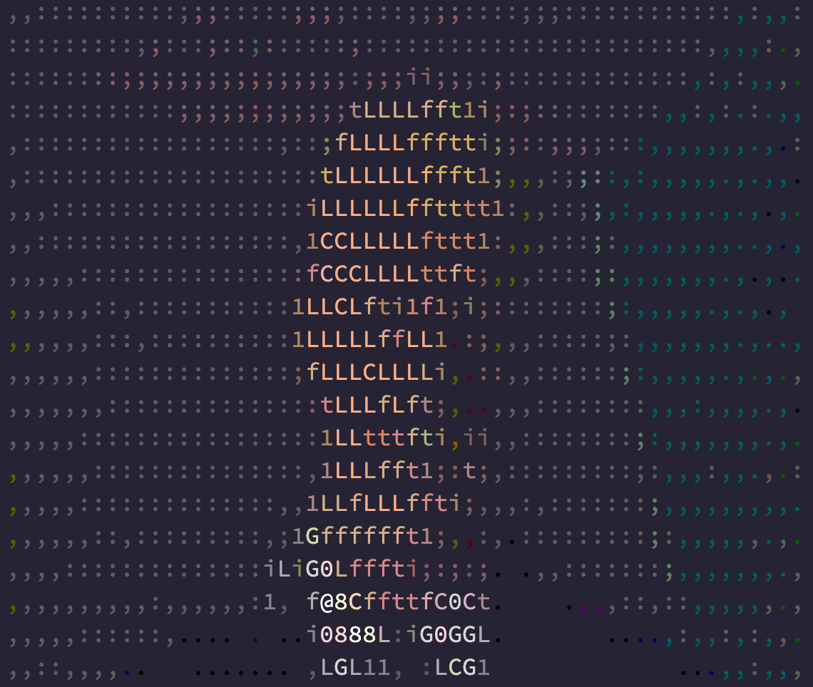

# Lab - Simple Node Application in a Docker Container

## **Objectives**

1. Describe the necessary commands to construct a container image.
1. Understand the importance of port forwarding when running a
container.
1. Practice using different commands to instruct the container to
execute the node application.

-------------------------------------------------

### **Requirements**

1. Docker container runtime

1. Latest version of `node` installed (e.g. via brew or installed via
source.)

1. Latest version of `yarn` installed (e.g. via brew or installed via
source.)

1. Text editor to edit the `dockerfile` containing the node application.

1. Latest version of `Graphicsmagick` installed (e.g. via brew
or installed via source.)

-------------------------------------------------

### **Steps**

1. Run the following command from your terminal:
  `$ git clone [repo]`

1. Change directories to the directory created in step 1. by
running:
  `$ cd [name of the directory in which the repository was cloned]`

1. Get all of the node application's dependencies by running the following
from the root directory of application:
  `$ yarn install`

1. Ensure the application is operational by running the following from the
command line:
  `$ yarn start`

The application takes the following image:

and converts it to "ASCII art". The output should be similar to the output
below:

-------------------------------------------------

Once you've completed the steps above, it's now time to containerize the
application. The first step in containerizing an application, script, or
binary is to define a container image. A container image is what's used by
the container runtime (e.g. `docker`) to create an instance of the
container image or just container for short. Think of the container image
as a template for creating an isolated instance of the application that's
housed within the container.

A container image is defined in Docker by creating a `dockerfile`. There
are many ways to begin a `dockerfile` and for the purposes of this lab we
need to start with an existing container image that supports the `node`
runtime.

> **Note**: There are many options to choose from when selecting the right 
> container image. There are containers from official sources, businesses,
> and the open source community at large. When in doubt, it's best to
> select the container image either from the source or officially endorsed
> by the organization.

For this lab we'll use the `17-alpine3.15` tagged container image from the
official source for `node` of the container image.
